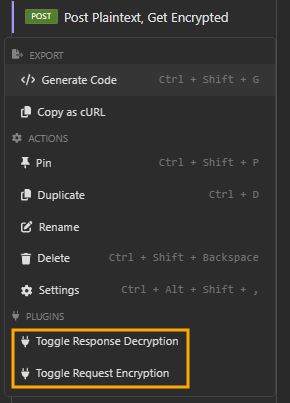

[](https://github.com/zaigr/insomnia-plugin-crypto/actions/workflows/build.yml)

# Insomnia Plugin Crypto

This is a plugin for [Insomnia](https://insomnia.rest/) that allows encrypting and decrypting request/response payloads using Node.js crypto.

## Features

- Encrypt and decrypt request/response payloads
- Toggle encryption/decryption for individual requests

## Usage

### Response Decryption

The plugin provides a response hook that decrypts the response body if decryption is enabled for the request.

1. Set the environment variables `crypto-alg` and `crypto-key` in your Insomnia environment.
2. Enable decryption for the request by using the **Toggle Response Decryption** action.

### Request Encryption

The plugin provides a request action to toggle body encryption for individual requests.

1. Right-click on the request and select **Toggle Request Encryption**.
2. A notification will appear indicating whether decryption is enabled or disabled for the request.



## Configuration

### Supported Algorithms

The following algorithms are supported for encryption and decryption:

- `aes-256-cbc`
- `aes-192-cbc`
- `aes-128-cbc`

### Environment Variables

- `crypto-alg`: The encryption algorithm to use.
- `crypto-key`: The key to use for encryption/decryption.
- `crypto-base64`: Whether to encode the encrypted data in base64. Default is `true`.

## Local Installation

1. Clone the repository or download the source code.
2. Navigate to the project directory.
3. Install the dependencies:
   ```sh
   npm install
   ```
4. Copy the plugin files to the Insomnia plugins directory:
   ```sh 
   npm run win-install # for Windows
   ```
